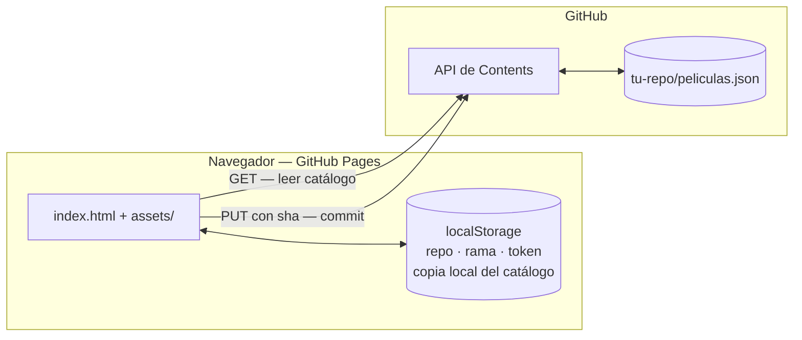

<div align="center">


# Mi Filmo

**Un diario de cine que vive en tu propio repositorio de GitHub.**

</div>

Diario personal de cine, series y documentales. Sin servidor, sin base de datos y sin cuenta de nada: la app es HTML estático y tus obras viven en un `peliculas.json` dentro de **tu propio repositorio de GitHub**.

Eso significa que puedes abrirla desde el móvil, el portátil o el ordenador de la facultad, añadir una película desde cualquiera de ellos y encontrarla en los demás. Cada cambio que haces es un commit en tu repo, con su fecha y su mensaje.

---

## Índice

- [Cómo funciona](#cómo-funciona)
- [Estructura del proyecto](#estructura-del-proyecto)
- [Haz tuya la app](#haz-tuya-la-app)
- [Usarla desde varios dispositivos](#usarla-desde-varios-dispositivos)
- [Modelo de datos](#modelo-de-datos)
- [Desarrollo local](#desarrollo-local)
- [Marca](#marca)
- [Decisiones y límites conocidos](#decisiones-y-límites-conocidos)
- [Actualizar las dependencias ancladas](#actualizar-las-dependencias-ancladas)
- [Roadmap](#roadmap)
- [Licencia](#licencia)

---

## Cómo funciona

No hay backend. El navegador habla directamente con la API de GitHub usando un token que tú generas y que se guarda únicamente en ese navegador.



### Lectura

Al abrir la app:

1. Si hay copia local guardada, **se pinta inmediatamente**. La app abre con contenido aunque no haya red.
2. En paralelo se pide `peliculas.json` a la API de GitHub y se guarda su `sha`.
3. Si la petición funciona, el catálogo se refresca y la copia local se actualiza.
4. Si falla, sigues viendo la copia local con un aviso que dice de cuándo es. Si no había copia, la app aparece **vacía y lo dice**: nunca inventa contenido para tapar un error.

Si el repositorio es público, la lectura funciona **sin token**. Solo escribir lo necesita.

### Escritura

Cada alta, edición o borrado reescribe el archivo entero con un commit:

```
PUT /repos/{usuario}/{repo}/contents/peliculas.json
{ "message": "Mi Filmo: Añadir \"La Odisea\"", "content": "<base64>", "sha": "<sha conocido>", "branch": "main" }
```

El `sha` es la pieza clave. Es el identificador de la versión que tú tenías cargada; si otro dispositivo guardó algo entretanto, ese `sha` ya no es el último y GitHub **rechaza** la escritura en lugar de pisar los cambios ajenos. La app detecta el rechazo, recarga la versión buena y te pide que repitas el cambio. Nunca se pierde en silencio lo que escribiste desde el móvil por guardar después desde el portátil.

### Historial gratis

Como cada cambio es un commit, el historial de tu repositorio es el historial de tu diario. `git log` sobre `peliculas.json` te dice qué añadiste y cuándo, y siempre puedes recuperar una review que borraste por error.

---

## Estructura del proyecto

```
Mi-Filmo/
├── index.html                 Estructura de la página y modales
├── peliculas.json             Tu catálogo (es la "base de datos")
├── site.webmanifest           Metadatos para instalarla como app
├── .nojekyll                  GitHub Pages sirve los archivos tal cual
└── assets/
    ├── css/styles.css         Lo que Tailwind no cubre: scrollbar, estrellas
    ├── icons/                 favicon.svg y maskable.svg
    └── js/
        ├── config.js          Constantes: tipos, claves, archivo de datos
        ├── utils.js           Escapado de HTML y formateo de fechas
        ├── storage.js         localStorage: ajustes y copia local
        ├── github.js          Capa de API. No toca el DOM
        ├── catalog.js         Modelo: normalizar, filtrar, ordenar
        ├── views.js           Plantillas HTML. Funciones puras
        ├── modals.js          Apertura, cierre y foco de los modales
        └── app.js             Estado y cableado. El único que lo conoce todo
```

La regla que ordena el árbol: **`github.js`, `catalog.js` y `views.js` no saben que existe una interfaz**. Solo `app.js` mezcla DOM, modelo y red. Eso permite cambiar cómo se pintan las tarjetas sin tocar la sincronización, y al revés.

No hay paso de compilación. Son módulos ES nativos que el navegador carga tal cual.

---

## Haz tuya la app

### 1. Copia el repositorio

Pulsa **Fork** arriba en GitHub, o crea un repo nuevo y sube estos archivos. Puedes borrar el `peliculas.json` de ejemplo y empezar de cero: la app lo crea sola al guardar tu primera obra.

### 2. Publícala en GitHub Pages

En tu repositorio: **Settings → Pages → Source: Deploy from a branch → `main` / `/ (root)` → Save**.

Un par de minutos después tendrás la app en `https://tu-usuario.github.io/tu-repo/`. Guárdala en favoritos en cada dispositivo.

### 3. Crea un token

Ve a **Settings → Developer settings → Personal access tokens → Fine-grained tokens → Generate new token** ([enlace directo](https://github.com/settings/personal-access-tokens/new)) y configúralo así:

| Campo | Valor |
|---|---|
| Resource owner | Tu cuenta |
| Expiration | Lo que prefieras (con caducidad la app avisará cuando expire) |
| Repository access | **Only select repositories** → solo tu repo de Mi Filmo |
| Permissions → Repository → **Contents** | **Read and write** |

No añadas ningún permiso más. `Metadata: Read-only` se activa solo; es normal y necesario.

Copia el token al generarlo: GitHub no vuelve a mostrarlo.

> Un token así solo puede tocar los archivos de ese repositorio. Es el radio de daño más pequeño que permite la plataforma para lo que hace esta app.

### 4. Conecta la app

Abre tu Mi Filmo, pulsa el engranaje y rellena:

- **Repositorio**: `tu-usuario/tu-repo` (también acepta la URL completa)
- **Rama**: `main`, salvo que uses otra
- **Token**: el que acabas de generar

Guarda. El banner debería decir *Sincronizado con tu-usuario/tu-repo*.

---

## Usarla desde varios dispositivos

Repite el **paso 4** en cada navegador desde el que quieras escribir. Los ajustes viven en el `localStorage` de cada uno, así que se configuran por separado: es tres minutos por dispositivo, una sola vez.

Puedes reutilizar el mismo token o generar uno por dispositivo. Uno por dispositivo es mejor: si pierdes el móvil, revocas ese token y los demás siguen funcionando.

Cosas que conviene saber:

- **Pulsa recargar (↻) al abrir la app** si sueles escribir desde varios sitios. La app carga la copia local primero y luego consulta GitHub, pero el botón fuerza la comprobación cuando quieras estar seguro.
- **Si dos dispositivos guardan a la vez**, el segundo recibe un aviso de conflicto y recarga la versión buena. No se pierde nada, pero hay que repetir el cambio.
- **En un dispositivo prestado, no pongas el token.** Sin token la app funciona en modo lectura si tu repo es público, que es justo lo que quieres para enseñarle tus reviews a alguien.

### Instalarla como app

El `site.webmanifest` permite añadirla a la pantalla de inicio (Chrome/Edge: *Instalar app*; iOS Safari: *Compartir → Añadir a pantalla de inicio*). Se abre sin barra del navegador y con su propio icono. Ojo: **todavía no hay service worker**, así que sin conexión verás la copia local pero la app tiene que estar ya cargada. El modo offline completo está en el roadmap.

---

## Modelo de datos

`peliculas.json` es un array plano. Cada obra:

| Campo | Tipo | Notas |
|---|---|---|
| `id` | string | Único. Lo genera la app (UUID) |
| `titulo` | string | Obligatorio |
| `director` | string | Puede ir vacío |
| `tipo` | string | Uno de los definidos en `config.js` |
| `valoracion` | number | De 0 a 5, en pasos de 0.5 |
| `etiquetas` | string[] | Libres. En el formulario se escriben separadas por comas |
| `review` | string | Texto libre, admite saltos de línea |
| `fechaVisionado` | string | `YYYY-MM-DD` |

```json
[
  {
    "id": "2a723847-de24-4507-b151-b88082b50dac",
    "titulo": "La Odisea",
    "director": "Cristopher Nolan",
    "tipo": "Película",
    "valoracion": 4,
    "etiquetas": [],
    "review": "Nolan es un genio. Una revisión excelente del poema de Homero.",
    "fechaVisionado": "2026-08-01"
  }
]
```

Puedes editar el JSON a mano desde GitHub sin miedo: al cargarlo, `catalog.js` normaliza cada registro. Un campo que falte se rellena con un valor por defecto, un tipo desconocido pasa a `Otro` y una valoración fuera de rango se recorta. Un registro mal escrito no tumba la app.

Una valoración de **0** no es lo mismo que "sin valorar": marca la tarjeta en rojo con la etiqueta *Para el olvido*, y tiene su propio filtro.

---

## Desarrollo local

La app usa módulos ES, así que **abrir `index.html` con doble clic no funciona**: el navegador bloquea los módulos servidos por `file://`. Necesitas un servidor estático, que es una línea:

```bash
python -m http.server 8123
```

Y abre `http://localhost:8123`. Con Node, `npx serve` hace lo mismo.

Para probarla desde el móvil en tu red local, sirve en `0.0.0.0` y entra por la IP de tu ordenador. En ese caso la conexión no es segura (`http://`), así que `crypto.randomUUID` no existe; `catalog.js` ya trae un generador de ids alternativo para ese caso.

No hay tests todavía. `catalog.js`, `github.js` y `views.js` están escritos como funciones puras precisamente para que añadirlos sea fácil cuando toque.

---

## Marca


El isotipo son **dos raíles perforados de película con una estrella dentro**: el soporte y la valoración, que son las dos cosas que hace la app. Los archivos están en `assets/brand/`:

| Archivo | Uso |
|---|---|
| `logo.svg` | Logotipo horizontal para fondos oscuros. El de por defecto |
| `logo-light.svg` | Logotipo horizontal para fondos claros |
| `logo-mono.svg` | Una sola tinta, hereda el color con `currentColor`. Para sellos y marcas de agua |
| `isotipo.svg` | Solo la marca, cuadrada, con todo el detalle |

Las letras del logotipo son **trazados, no texto**: el archivo se ve igual en cualquier ordenador sin tener Bebas Neue instalada, y no depende de que cargue ninguna fuente.

### Paleta

| | Hex | Papel |
|---|---|---|
| Rojo | `#b3312c` | Acciones principales, raíles del isotipo, obras "para el olvido" |
| Oro | `#d1a355` | Marca, valoraciones, acentos |
| Fondo | `#1a1210` | Base de la app |
| Fondo suave | `#2b1c19` | Tarjetas y modales |
| Texto | `#f5ece4` | Texto principal |
| Texto atenuado | `#c9b8ae` | Texto secundario |
| Línea | `#4a2e28` | Bordes y separadores |

Tipografías: **Bebas Neue** para títulos, **Work Sans** para el resto.

### Iconos de aplicación

`assets/icons/favicon.svg` es una **versión simplificada a propósito**: sin perforaciones, sin borde interior y con la estrella más grande. A 16 píxeles el detalle del isotipo se denta y se convierte en ruido, así que la pestaña del navegador usa la versión maciza y `isotipo.svg` se reserva para tamaños de 32 píxeles en adelante.

---

## Decisiones y límites conocidos

**El token está en `localStorage`.** Es la única forma de escribir en GitHub sin montar un backend, y montarlo contradiría el objetivo del proyecto. Las mitigaciones son: token *fine-grained* limitado a un repo con un solo permiso, dependencias externas ancladas a una versión concreta, y todo dato del catálogo escapado antes de tocar el DOM. Aun así, es una decisión consciente con un coste: cualquier script que se ejecutase en la página podría leer ese token. No pongas ahí un token con permisos amplios.

**Si tu repositorio es público, tus reviews son públicas.** Cualquiera puede leer `peliculas.json`. Si las quieres privadas tienes dos caminos: hacer el repo privado (pero GitHub Pages sobre repo privado requiere cuenta de pago), o separar las cosas — la app en un repo público con Pages y los datos en un repo privado, ya que en Configuración puedes apuntar a cualquier repositorio.

**Límite de 1 MB.** La API de Contents no devuelve el contenido de archivos mayores. Con reviews de tamaño normal eso son entre 1500 y 2500 obras. Cuando llegue el momento habrá que partir el archivo o usar la Blobs API; la app avisa con un mensaje claro en vez de fallar de forma rara.

**Límite de peticiones.** Sin token, GitHub permite 60 peticiones por hora y por IP. Con token, 5000. Si usas la app mucho en modo lectura sin token, puedes tocar el techo.

**Tailwind se carga por CDN.** Su propia documentación desaconseja el CDN en producción y el navegador lo avisa por consola. Cambiarlo obligaría a introducir un paso de compilación, que es exactamente lo que este proyecto quiere evitar. Es un intercambio aceptado.

**Escritura de archivo completo.** Cada cambio reescribe todo el JSON. Es simple y robusto para un catálogo personal, y el control por `sha` evita las pérdidas. No escala a muchos usuarios escribiendo a la vez, pero no es ese el caso de uso.

---

## Actualizar las dependencias ancladas

Las dependencias externas van fijadas a una versión concreta en `index.html`. Sin eso, cualquier publicación futura de esos paquetes se ejecutaría en la página con acceso al token.

**Lucide** lleva además `integrity` (SRI): el navegador comprueba el hash del archivo y lo rechaza si no coincide. Al cambiar de versión hay que recalcular ese hash:

```bash
curl -s https://unpkg.com/lucide@X.Y.Z/dist/umd/lucide.min.js | openssl dgst -sha384 -binary | openssl base64 -A
```

Pon el resultado precedido de `sha384-` en el atributo `integrity`.

**Tailwind va sin `integrity`** a propósito: `cdn.tailwindcss.com` no envía cabeceras CORS, y sin ellas el navegador no puede verificar el hash y bloquearía el script por completo (la app se vería sin ningún estilo). El anclaje de versión es la protección que sí se puede aplicar ahí.

---

## Roadmap

La v1 hace una cosa: registrar lo que has visto, puntuarlo y volver a encontrarlo. Todo lo de abajo se ha dejado fuera deliberadamente.

## v2 — más datos y dos idiomas

### Internacionalización (ES / EN)

Que la plataforma se pueda usar en inglés, con detección automática vía `navigator.language` y un selector para forzar el idioma.

El trabajo visible es mover todas las cadenas de `index.html` y `app.js` a `assets/js/i18n/es.js` y `en.js`, y hacer que `formatDate` deje de tener `'es-ES'` escrito a fuego en `utils.js`.

El trabajo invisible es el que importa: hoy `tipo` guarda la etiqueta que se muestra (`"Película"`). Si la interfaz cambia de idioma, ese valor no puede seguir siendo el texto visible. Hay que separar la clave almacenada de la etiqueta traducida:

```jsonc
// ahora
{ "tipo": "Película" }

// v2
{ "tipo": "pelicula" }   // clave estable; la etiqueta la pone el idioma activo
```

Eso es una migración del JSON, así que conviene que viaje junto al resto de cambios de esquema de abajo, en una sola migración versionada, y no en dos pasadas.

### Modelo de datos

- **Año de estreno**, hoy inexistente: sin él no se pueden distinguir dos películas homónimas ni ordenar por época.
- **Póster o imagen**, probablemente vía TMDb, con la URL guardada en el JSON.
- **Revisionados**: `fechaVisionado` es una sola fecha. Un diario de cine de verdad necesita un array de visionados, cada uno con su fecha y quizá su nota.
- **Temporada y episodio** para las series, que hoy comparten esquema con las películas pese a tener su propio tipo.
- **Dónde la viste**: cine, casa, festival. Es el campo que más se echa de menos al releer un diario años después.
- **Migración de esquema versionada**, para que ampliar el modelo no rompa los JSON existentes.

### Funcionalidad

- **Watchlist**: obras pendientes, separadas de las ya vistas.
- **Estadísticas**: obras por mes, media de valoración, directores más vistos, nube de etiquetas. Es lo que justifica llevar el diario.
- **Búsqueda mejor**: hoy solo mira título y director, distingue acentos y no busca en etiquetas ni en el texto de las reviews.
- **Orden configurable**: ahora está fijo por fecha descendente. Falta por valoración y por título.
- **Deshacer un borrado**, más allá del `confirm()` actual.
- **Importar y exportar**, incluido CSV de Letterboxd.
- **Offline real** con service worker, para poder escribir sin conexión y sincronizar al recuperarla.

## v3 — fuera del navegador

### Escritorio: un ejecutable

La vía es **Tauri**: envuelve este mismo HTML, CSS y JavaScript en el motor web que ya trae el sistema operativo y produce un `.exe` de unos pocos megas. Electron haría lo mismo pero empaquetando Chromium entero, y el instalador se iría a más de 100 MB para una app que son 40 KB de código.

Más allá del formato, la versión de escritorio desbloquea algo que el navegador no permite: **guardar el token en el almacén de credenciales del sistema** (el Administrador de credenciales de Windows, el llavero de macOS) en lugar de en `localStorage`. Eso elimina de raíz la principal pega de seguridad de la v1. Es el mejor argumento para hacerla, más que el icono en el escritorio.

### Móvil

Una aclaración antes de nada: **Docker no sirve para esto**. Un contenedor es un entorno Linux para ejecutar un servidor en una máquina; un teléfono no ejecuta contenedores, instala un APK, un IPA o una PWA. No hay forma de convertir un contenedor en una app de móvil.

Las vías que sí llevan a una app en el teléfono, de menos a más esfuerzo:

1. **PWA con service worker.** El `site.webmanifest` ya está puesto; falta el service worker. Con eso la app se instala desde el navegador, aparece con su icono en la pantalla de inicio y funciona sin conexión. Sin tiendas, sin cuentas de desarrollador y sin coste. Es el 90 % del resultado por el 10 % del trabajo.
2. **Capacitor o TWA**, para empaquetar esa misma PWA en un APK o un IPA de verdad y poder subirla a las tiendas. Requiere Android Studio o Xcode y cuenta de desarrollador (25 $ una vez en Google, 99 $/año en Apple). Solo compensa si quieres distribuirla a otra gente.

Docker sí tendría sentido en este proyecto en un caso concreto: si algún día se sustituyera GitHub por un servidor de sincronización propio, ese servidor se distribuiría como contenedor. Pero eso contradice la premisa de la app, que es justamente no tener servidor.

### Fuera de alcance

Multiusuario, backend propio y login con OAuth. Si el proyecto necesitase eso dejaría de ser lo que es: una app estática que cualquiera puede forkear y tener funcionando en cinco minutos.

---

## Licencia

MIT. Ver [LICENSE](LICENSE).
